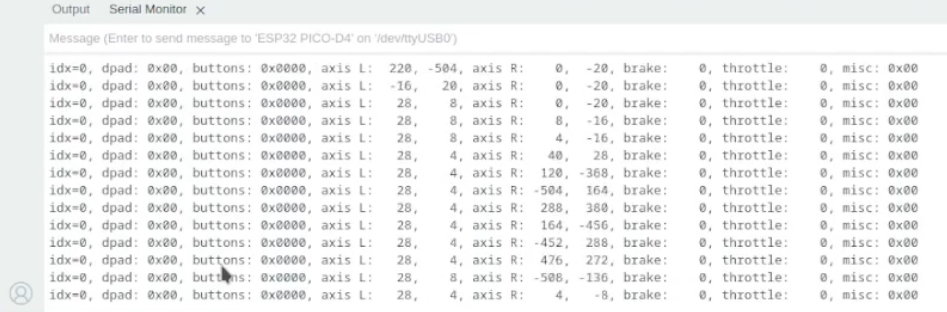

## ALL DESIGN CONSIDERATIONS:

10/5/24:
- Started using a PS4 controller for Bluetooth connection to the ESP32. However, there are some concerns about latency. We expect the latency to be around 1s, which is right on the border of our high-level requirement. If possible, we might pivot to using an Xbox controller since it uses BLE (Bluetooth low energy), which would be better for power and significantly reduce latency. But it is also more difficult to code. We referenced this document: https://docs.espressif.com/projects/esp-idf/en/stable/esp32/api-reference/bluetooth/index.html 
- We also discussed what materials we should finally use. We saw suggestions about using PLA+ throughout, but need to research the use of PETG.

10/15/24:
- We decided that using the Xbox controller and incorporating BLE would be the right decision. The proposed data packet format would be 8-bit left-wheel intensity, 8-bit right-wheel intensity, 8-bit weapon motor intensity, and 8-bit system command that we would use for our kill switch. We developed some preliminary code and showed the following printing on the terminal

10/21/24:
- We modeled our bot through CAD and this is what we got: 

## MEETINGS RECAP AND MORE:
9/18/24:
- Met with Gregg in the machine shop. 

9/25/24:
- checked Github notebooks

- opinions on the proposal
  - improve the introduction by describing the background of battle bots and the competition
  - label the visual aid
  - label data transmission lines in the block diagram
  - add voltage value to the voltage regulator in the block diagram
  - include the use of the PWM with the motors
  - requirements need hard metrics. Under each subsystem requirement, what should it satisfy to know that it's working

- discussed design document

9/30/24:
- Submitted the design document. Discussed proposal regrade.

10/8/24:
- Attended the design review. Got suggestions on ESCs. Also talked about how we will be implementing our blade. Should it be
  in the middle of the bot or the top? We talked a little about things on our PCB but this is still quite uncertain. 

10/16/24:
- Submitted our PCB design for the first iteration. There may be potential issues with the resistors/capacitors we are using.
- Reminder to submit the team evaluation form due today.
- Already met with machine shop people so that's nice.

10/23/24:
- Submitted our second round of PCB orders after modifying the first one. But it turns out the first one is too small.
- Going to work on a better, larger design (10x10cm) to be able to solder for our third-week order.

10/30/24:
- Design document suggestions/missing things:
  - Lost 2 points for PCB schematic
  - Missing citations
  - Everything else looks good
 
11/6/24:
- Met over Zoom today, which was nice
- Submitted our new board today, let's see how it goes.
- Reminder for the individual progress report due today.
- Also a reminder for the design doc that needs to be updated and submitted by the day after tomorrow.

11/13/24:
- Sign up for presentation and demo times
- 

