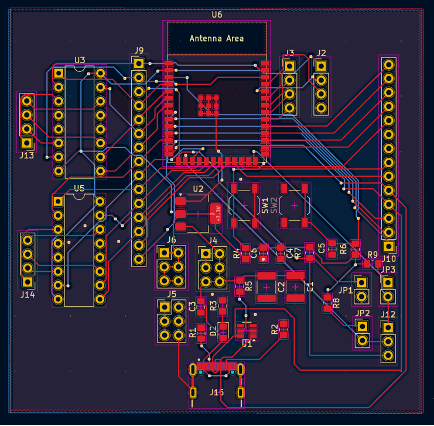
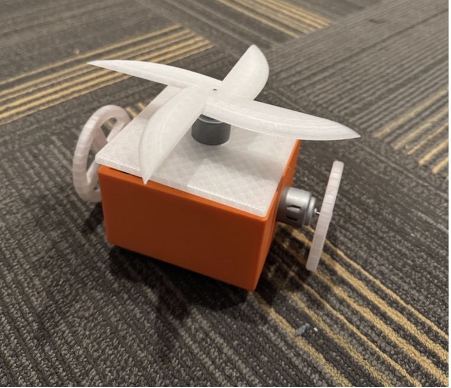

## Lab Notebook 2024  

### **Lab Notebook Entry #1**  
**Date:** 2024-10-07  
**Objective:** Antweight Battlebot - Initial Design and Planning  

**Work Done:**  
- Collaborated with the team to establish project goals and responsibilities through the team contract.  
- Researched past projects to identify solutions for wireless communication.  
- Explored programming languages and libraries for testing wireless communication and motor control.  
- Evaluated microcontrollers and wireless components for compatibility.  
- Drafted the first schematic design and selected components.  
- Submitted the design document for review.  

**Observations:**  
- STM32 Microcontroller with an external wireless module and Mini-USB was identified as the initial solution.  
- Drafted schematics in KiCad, highlighting voltage regulators and motor drivers.  

---
#### Parameters  

- **Maximum bot mass (M):** 0.9 kg  
- **Blade mass (m):** 0.15 kg  
- **Blade radius (r):** 0.09 m  
- **Desired impact force (F):** 30 N  
- **Bot width:** 0.18 m  

##### Analysis  

###### Moment of inertia (\(I\)) of the blade  
\[
I = \frac{1}{2} m r^2 = 0.5 \cdot 0.15 \cdot 0.09^2 = 0.000608 \, \text{kg} \cdot \text{m}^2
\]

###### Angular velocity (\(\omega\)) required for the desired impact force  
\[
F = m r \omega^2 \quad \implies \quad \omega = \sqrt{\frac{F}{m r}} = \sqrt{\frac{30}{0.15 \cdot 0.09}} \approx 51.64 \, \text{rad/s}
\]

###### Converting to RPM  
\[
\omega_{\text{RPM}} = \omega \cdot \frac{60}{2\pi} = 51.64 \cdot \frac{60}{2\pi} \approx 493 \, \text{RPM}
\]

###### Angular momentum (\(L\)) of the blade  
\[
L = I \cdot \omega = 0.000608 \cdot 51.64 \approx 0.0314 \, \text{kg} \cdot \text{m}^2/\text{s}
\]

###### Gyroscopic precession torque (\(\tau\)) when the bot turns  
\[
\tau = L \cdot \Omega, \quad \text{where turning rate (\(\Omega\))} = 2.5 \, \text{rad/s}
\]
\[
\tau = 0.0314 \cdot 2.5 \approx 0.0785 \, \text{N} \cdot \text{m}
\]

###### Compare the gyroscopic torque to the bot's weight moment  
\[
\text{Weight moment} = M \cdot g \cdot \frac{\text{width}}{2}, \quad \text{where \(g = 9.81 \, \text{m/s}^2\)}
\]
\[
\text{Weight moment} = 0.9 \cdot 9.81 \cdot 0.09 \approx 0.795 \, \text{N} \cdot \text{m}
\]


##### Tolerance Range  

- **Lower bound:** 425 RPM (to maintain sufficient impact force)  
- **Upper bound:** 575 RPM (to limit gyroscopic effects)  


##### Feasibility  

The calculated optimal speed of **493 RPM** falls within the tolerance range. The gyroscopic torque (\(0.0785 \, \text{N} \cdot \text{m}\)) is significantly less than the bot's weight moment (\(0.795 \, \text{N} \cdot \text{m}\)), ensuring stability during turns even at this scale.

---

### **Lab Notebook Entry #2**  
**Date:** 2024-10-23  
**Objective:** Antweight Battlebot - PCB Refinement and BLE Protocol Development  

**Work Done:**  
- Pivoted to ESP32-S3-WROOM-1 due to availability in the lab.  
- Began prototyping with the ESP32 development board.  
- Created the first PCB design based on feedback, optimizing power delivery.  
- Submitted the updated PCB design for review.  

**Results:**  
- Tested BLE capabilities on ESP32-S3-WROOM-1; planned switch to ESP32-S3-MINI1 for cost efficiency and external antenna support.  
- Identified BLE as the most power-efficient and low-latency wireless solution for Xbox controller integration.  
- Adjusted PCB layout for chassis mounting.  

#### Images:  
  
*Caption: Initial PCB schematic with annotations for power delivery and motor control pathways.*  


  
*Caption: First PCB design showing key layout optimizations for power delivery.*  

---

### **Lab Notebook Entry #3**  
**Date:** 2024-11-04  
**Objective:** Antweight Battlebot - Mechanical Design and 3D Printing  

**Work Done:**  
- Designed the bot’s CAD model, focusing on dimensions (18 cm × 18 cm × 5 cm) and weight distribution to stay within the 2-lb limit.  
- Initiated 3D printing of chassis and wheel components using PETG.  
- Integrated motor controllers into the chassis design.  

**Observations:**  
- Initial prototypes were lightweight and structurally sound.  
- Adjustments required for motor mounting and wheel alignment.  

#### Images:  
  
*Caption: Exploded view of the CAD model highlighting subsystem placement.*  

---

### **Lab Notebook Entry #4**  
**Date:** 2024-11-18  
**Objective:** Antweight Battlebot - Subsystem Integration  

**Work Done:**  
- Finalized AMS1117 voltage regulator-based power circuits for stable 3.3V output.  
- Implemented BLE communication with Xbox controllers for motor and weapon control.  
- Conducted preliminary subsystem interaction tests, ensuring seamless integration.  

**Observations:**  
- Achieved joystick precision within ±3% of expected values.  
- Power subsystem stable under a 7A peak current draw.  

---

### **Lab Notebook Entry #5**  
**Date:** 2024-11-28  
**Objective:** Antweight Battlebot - Preliminary System Testing  

**Work Done:**  
- Integrated wireless control with motor drivers and weapon systems.  
- Conducted mobility and traction tests.  
- Verified weapon speed and safety compliance during impact tests.  

**Observations:**  
- Motor speed averaged 743 RPM, within the target range of 600-750 RPM.  
- Chassis vibration was minimal during operational tests.  

#### Images:  
  
*Caption: Final PCB schematic with labeled connections and components.*  

  
*Caption: Final PCB design optimized for power delivery and signal integrity.*  

  
*Caption: Fully assembled and functional Antweight Battlebot.*  

---

### **Lab Notebook Entry #6**  
**Date:** 2024-12-02  
**Objective:** Antweight Battlebot - Final Integration and Validation  

#### Objective: Comprehensive System Testing and Optimization  

**Work Done:**  
- Conducted final end-to-end system testing, including BLE latency and chassis impact resistance.  
- Optimized latency to 50 ms through protocol refinement.  
- Verified weight compliance and full operational readiness.  

#### Observations:  
- Final bot weight: 1.3 lbs, comfortably within the 2-lb limit.  
- Weapon impact force validated at 30 N during repeated trials.  

#### Images:  
---
  
*Caption: Annotated PCB schematic showing power distribution and motor control pathways.*  


  
*Caption: Annotated PCB schematic showing power distribution and motor control pathways.*  

---

#### Code Snippet: BLE Packet Transmission  

```c
#include <Bluepad32.h>

ControllerPtr myControllers[BP32_MAX_GAMEPADS];

// Motor control pins (GPIOs)
const int EN1 = 13, IN1 = 18, IN2 = 32; // Motor 1
const int EN2 = 26, IN3 = 25, IN4 = 33; // Motor 2
const int EN3 = 27, IN5 = 12, IN6 = 14; // Motor 3

// Deadzone value
const int DEADZONE = 50;

// Initialize motor pins
void setupMotorPins() {
    pinMode(EN1, OUTPUT);
    pinMode(IN1, OUTPUT);
    pinMode(IN2, OUTPUT);
    pinMode(EN2, OUTPUT);
    pinMode(IN3, OUTPUT);
    pinMode(IN4, OUTPUT);
    pinMode(EN3, OUTPUT);
    pinMode(IN5, OUTPUT);
    pinMode(IN6, OUTPUT);

    // Start all motors off (low PWM signal)
    analogWrite(EN1, 0);
    analogWrite(EN2, 0);
    analogWrite(EN3, 0);
    digitalWrite(IN1, LOW);
    digitalWrite(IN2, LOW);
    digitalWrite(IN3, LOW);
    digitalWrite(IN4, LOW);
    digitalWrite(IN5, LOW);
    digitalWrite(IN6, LOW);
}

// Function to apply deadzone
int applyDeadzone(int value) {
    if (abs(value) < DEADZONE) {
        return 0;  // Inside the deadzone, return 0
    }
    return value;
}

void onConnectedController(ControllerPtr ctl) {
    bool foundEmptySlot = false;
    for (int i = 0; i < BP32_MAX_GAMEPADS; i++) {
        if (myControllers[i] == nullptr) {
            Serial.printf("CALLBACK: Controller is connected, index=%d\n", i);
            myControllers[i] = ctl;
            foundEmptySlot = true;
            break;
        }
    }
    if (!foundEmptySlot) {
        Serial.println("CALLBACK: Controller connected, but could not found empty slot");
    }
}

void onDisconnectedController(ControllerPtr ctl) {
    bool foundController = false;
    for (int i = 0; i < BP32_MAX_GAMEPADS; i++) {
        if (myControllers[i] == ctl) {
            Serial.printf("CALLBACK: Controller disconnected from index=%d\n", i);
            myControllers[i] = nullptr;
            foundController = true;
            break;
        }
    }
    if (!foundController) {
        Serial.println("CALLBACK: Controller disconnected, but not found in myControllers");
    }
}

// Control motors based on the input from the gamepad
void controlMotors(ControllerPtr ctl) {
    // Read the Y-axis of the left stick (motor 1 control)
    int motor1Speed = applyDeadzone(ctl->axisY());  // Range is from -511 to 512
    int pwm1 = map(motor1Speed, -511, 512, -255, 255);
    
    // Set motor 1 direction and speed
    if (pwm1 > 0) {
        digitalWrite(IN1, HIGH);
        digitalWrite(IN2, LOW);
    } else if (pwm1 < 0) {
        digitalWrite(IN1, LOW);
        digitalWrite(IN2, HIGH);
    } else {
        digitalWrite(IN1, LOW);
        digitalWrite(IN2, LOW);
    }
    analogWrite(EN1, abs(pwm1));  // Control the speed (PWM)

    // Read the Y-axis of the right stick (motor 2 control)
    int motor2Speed = applyDeadzone(ctl->axisRY());  // Range is from -511 to 512
    int pwm2 = map(motor2Speed, -511, 512, -255, 255);
    
    // Set motor 2 direction and speed
    if (pwm2 > 0) {
        digitalWrite(IN3, HIGH);
        digitalWrite(IN4, LOW);
    } else if (pwm2 < 0) {
        digitalWrite(IN3, LOW);
        digitalWrite(IN4, HIGH);
    } else {
        digitalWrite(IN3, LOW);
        digitalWrite(IN4, LOW);
    }
    analogWrite(EN2, abs(pwm2));  // Control the speed (PWM)

    // Read the throttle (right trigger) for motor 3 control
    int motor3Speed = applyDeadzone(ctl->throttle());  // Range is from 0 to 1023
    int pwm3 = map(motor3Speed, 0, 1023, 0, 255);

    // Set motor 3 direction and speed
    if (motor3Speed > 0) {
        digitalWrite(IN5, HIGH);
        digitalWrite(IN6, LOW);
    } else {
        digitalWrite(IN5, LOW);
        digitalWrite(IN6, LOW);
    }
    analogWrite(EN3, pwm3);  // Control the speed (PWM)
}

void processGamepad(ControllerPtr ctl) {
    controlMotors(ctl);  // Control motors based on gamepad input
}

void processControllers() {
    for (auto myController : myControllers) {
        if (myController && myController->isConnected() && myController->hasData()) {
            if (myController->isGamepad()) {
                processGamepad(myController);
            }
        }
    }
}

// Arduino setup function. Runs in CPU 1
void setup() {
    Serial.begin(115200);
    Serial.printf("Firmware: %s\n", BP32.firmwareVersion());
    const uint8_t* addr = BP32.localBdAddress();
    Serial.printf("BD Addr: %2X:%2X:%2X:%2X:%2X:%2X\n", addr[0], addr[1], addr[2], addr[3], addr[4], addr[5]);

    // Setup the Bluepad32 callbacks
    BP32.setup(&onConnectedController, &onDisconnectedController);

    // Forget Bluetooth keys (optional)
    BP32.forgetBluetoothKeys();

    // Setup motor control pins
    setupMotorPins();

    // Enable virtual devices (optional)
    BP32.enableVirtualDevice(false);
}

// Arduino loop function. Runs in CPU 1.
void loop() {
    bool dataUpdated = BP32.update();
    if (dataUpdated)
        processControllers();

    delay(150);  // Yield to lower priority tasks
}
```
*Caption: Code snippet for transmitting BLE data packet to control motors and weapon.*  


## References  

1. "How to use L293D motor driver with ESP32," YouTube, uploaded by Arnov Sharma, 6 Jul 2020. [Online]. Available: https://www.youtube.com/watch?v=aDBF9Yj04MU [Accessed: Dec. 11 2024].  
2. "ESP32 and 6 motor driver PCB board," YouTube, uploaded by KOKENSHA TECH, 5 Sept 2024. [Online]. Available: https://www.youtube.com/watch?v=TynKvJ_xZA8 [Accessed: Dec. 11 2024].  
3. Espressif Systems, "ESP32-S3-DEVKITM-1 V1 Schematics," Mar. 10, 2021. [Online]. Available: https://dl.espressif.com/dl/schematics/SCH_ESP32-S3-DEVKITM-1_V1_20210310A.pdf [Accessed: Dec. 11 2024].  
4. Espressif Systems, "Espressif KiCad Libraries - Footprints," GitHub. [Online]. Available: https://github.com/espressif/kicad-libraries/tree/main/footprints/Espressif.pretty [Accessed: Dec. 11 2024].  
5. Advanced Monolithic Systems, "AMS1117-3.3 Datasheet," [Online]. Available: https://www.alldatasheet.com/datasheet-pdf/pdf/205691/ADMOS/AMS1117-3.3.html [Accessed: Dec. 11 2024].  
6. ON Semiconductor, "SRV05-4 Datasheet," [Online]. Available: https://www.onsemi.com/pdf/datasheet/srv05-4-d.pdf [Accessed: Dec. 11 2024].  
7. Texas Instruments, "L293D Datasheet," [Online]. Available: https://www.ti.com/lit/ds/symlink/l293.pdf [Accessed: Dec. 11 2024].  
8. Rachel De Barros, "Connect Your Game Controller to an ESP32: The Complete Guide," Electronics, Robotics & Animatronics Engineering Artist, Aug. 30, 2024. [Online]. Available: https://racheldebarros.com/esp32-projects/connect-your-game-controller-to-an-esp32/ [Accessed: Nov. 07, 2024].  
9. "ESP32 BLE Server and Client (Bluetooth Low Energy) | Random Nerd Tutorials," Nov. 11, 2021. [Online]. Available: https://randomnerdtutorials.com/esp32-ble-server-client/ [Accessed: Dec. 11 2024].  
10. "In-Depth: Getting Started with the ESP32 Bluetooth Low Energy (BLE)," Last Minute Engineers, Sep. 10, 2023. [Online]. Available: https://lastminuteengineers.com/esp32-ble-tutorial/ [Accessed: Dec. 11 2024].  
11. Instructables, "Boxxer the Battle Bot (Esp32)," May 19, 2023. [Online]. Available: https://www.instructables.com/Boxxer-the-Battle-Bot-Esp32/ [Accessed: Dec. 11 2024].  
12. Espressif Systems, "Establish Serial Connection with ESP32 - ESP-IDF Programming Guide," docs.espressif.com. [Online]. Available: https://docs.espressif.com/projects/esp-idf/en/latest/esp32/get-started/establish-serial-connection.html [Accessed: Dec. 11 2024].  


--- 

